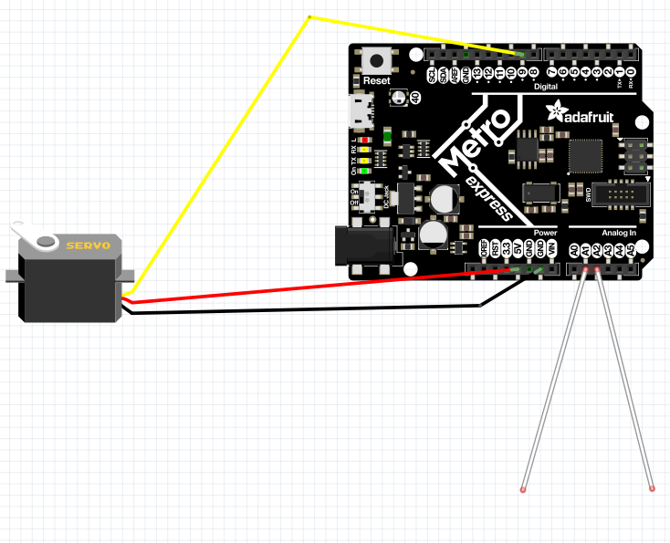
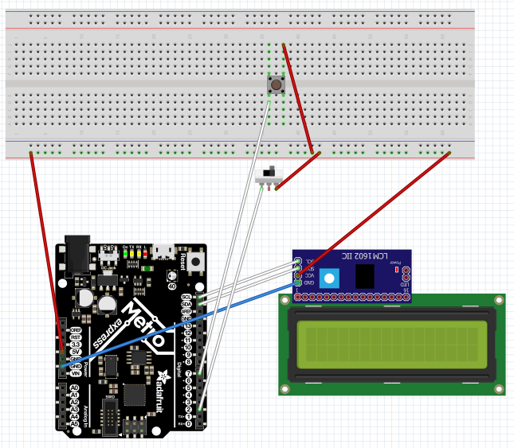
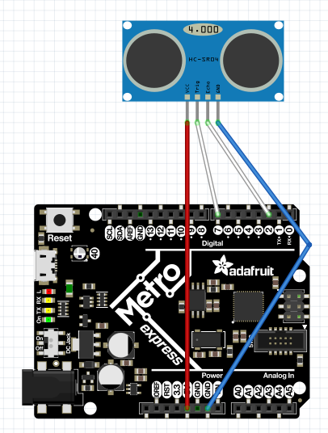
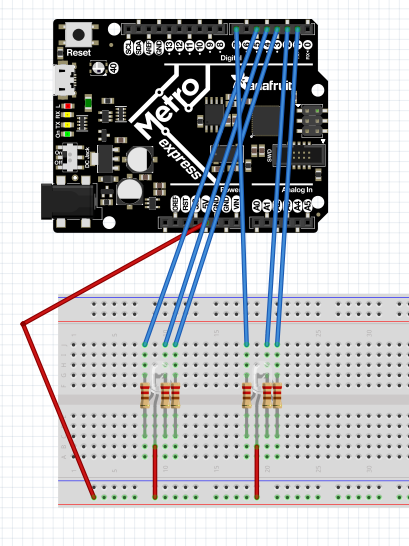
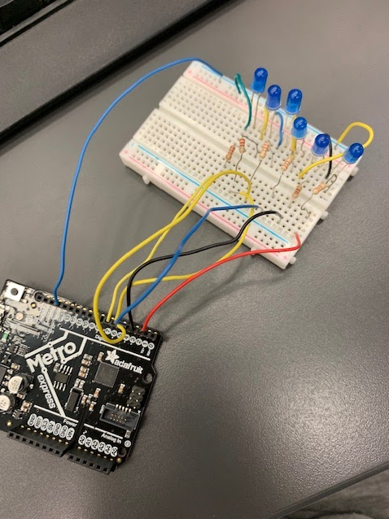

# CircuitPython
## My CircuitPython assignments

### LEDFade:
#### Objective
Make a LED fades in and out.


#### Lessons
In this assignment we learned how to use our new metro board and how to use CircuitPython on Mu.
#### Important Code
`LED.py`
``` python
    
while True:
    led.value = holder     #Sets the LED to a value
    time.sleep(0.1)
    holder += changer      #adds brightness (or subtracts)
    print(holder)          #prints to serial monitor


    if holder >= 60000:
        changer *= -1       #if the led is at the threshold, it makes the changer negative

    if holder <= 2000:
        changer *= -1
```
Our variable counts up, but once it reaches 6000, it multiplies it by a negative and it counts down until it reaches 2000, where it begins to count up. 

  

### ServoTouch:
#### Objective
A Servo moves right or left, depending on if a wire is touched, using Capacitive Touch.
#### Picture


#### Lessons
In this assignment we learned how to use Capacitive touch, and how to control servos CircuitPython. When you touch one of the wires, your finger discharges to it, which lets the Metro know that you touched it.  
#### Important Code
`ServoTouch.py`
``` python
    if touch_A0.value: #if wire is touched
        moth_slippers.throttle = 1.0 #rotate slowly forwards
        print("A0")
    if touch_A4.value: 
        moth_slippers.throttle = -1.0
        print("A4") #rotate slowly forwards
    if not touch_A0.value and not touch_A4.value:

        moth_slippers.throttle = 0.0
        # makes sure servo doesn't move when wires aren't touched
    time.sleep(0.1)
```
We called our servo "moth_slippers," when one wire was touched we set the throttle to a postive speed and if the other was touched it was set to a negative speed. 

### LCDButtonSwitch:

#### Objective
A switch determines if a counter is increased, or decreased when a button is pushed. The counter is displayed on a LCD screen.
#### Picture


#### Lessons
In this assignment we learned how to use LCD screens and switches / buttons on CircuitPython. We had to make two boolean variables along with some logic that made sure the button wouldn't count more than once if it was held down. We also had an issue with the LCD glitching sometimes, so we had it print nothing to reset it.  

#### Important Code

`LCDButton.py`
``` python
fread = True
while True:
    lcd.set_cursor_pos(0, 0) #sets cursor in proper position
    lcd.print("SwitchState:")
    if switch.value:
        fread = True #logic so it doesn't repeat
    else:
        if fread == True:
            if switch2.value:
                lcd.print("Up")
                lcd.print("    ") #spacer so it doesn't break
                presses +=1
                fread = not fread #resets fread
            else:
                lcd.print("Down")
                lcd.print("    ")
                presses -=1
                fread = not fread #resets fread
```
Above is the logic to see if the button is being held down, and if it is, it makes sure it doesn't counter until it has been released. 

### PhotoInterrupter:
#### Objective
Every 4 seconds, the number of times the photo interrupter has been interrupted is displayed.

#### Lessons
In this assignment we learned how to use photointerrupters on CircuitPython. We used the same logic as in the LCD Button switch to make sure that it wouldn't count more than once when it was interuppted. We also found out how similiar a photo interuppter and a button are coded. 
#### Important Code
`PhotoInteruppter.py`
``` python
initial = time.monotonic() #sets initial time
while True:
    now = time.monotonic() #sets current time
    if now - initial == 4:  # If 4 elapses
        print("I have been interrupted", presses, "times.")
        initial = time.monotonic() #resets initial
```

This is the part of the code that allows us to have the four second delay without using the time.sleep command. We use the amount of time the board has been up to set an initial read. We then set the current time, if the current time minus the initial time is equal to four we run the code and reset the initial time. 
### DistanceSensor:
#### Objective
Determines the distance from an object, and lights up a LED accordingly.
#### Picture


#### Lessons
In this assignment we learned how to use distance sensors on CircuitPython, and the neopixel on our metro. We had to map the values of each variable(R, G, B) so it could smoothly fade through colors. 
#### Important Code
`DistanceSensor.py`
``` python
        if sonar.distance <= 20: #if within range run red sequence

            r = simpleio.map_range(sonar.distance, 0,20,255,0)
            b = simpleio.map_range(sonar.distance, 5,20,0,255)
            g = simpleio.map_range(sonar.distance, 20,35,0,255)

        else: #run blue/green sequence
            r = simpleio.map_range(sonar.distance, 0,20,255,0)
            b = simpleio.map_range(sonar.distance, 35,20,0,255)
            g = simpleio.map_range(sonar.distance, 20,35,0,255)

        dot.fill((int(r),int(g),int(b))) #send rgb values to LED
```

We mapped the RGB variables to match the different distances. We essentially divided the distance into two different zones; the red zone and the blue/green zone.                                                      

### ClassesObjectsAndModules:
#### Objective
Uses a library I made, rgb, to run different led functions.
#### Picture


#### Lessons
In this assignment we learned how to use classes, objects, and modules on CircuitPython. It took a bit to understand how they worked, but once you get used to using the different functions its pretty easy. 
#### Important Code
`rgb.py`
``` python
     def rainbow1(self):#fades through all colors slowly
        rate= 128
        #print("rainbow")
        #self.r.duty_cycle = 0
        #self.b.duty_cycle = 2 ** 16-1
        #self.g.duty_cycle = 2 ** 16-1
        for i in range (0, 2 ** 16, rate):
            self.r.duty_cycle = 0+i
            self.b.duty_cycle = 2 ** 16-1-i
            self.g.duty_cycle = 2 ** 16-1
        for i in range (0, 2 ** 16, rate):
            self.r.duty_cycle = 2 ** 16-1
            self.b.duty_cycle = 0+i
            self.g.duty_cycle = 2 ** 16-1-i
        for i in range (0, 2 ** 16, rate):
            self.r.duty_cycle = 2 ** 16-1-i
            self.b.duty_cycle = 2 ** 16-1
            self.g.duty_cycle = 0+i
```

We used this logic to make the LED fade through out the rainbow. We used 2^16-1 since 2^16 was just barely too big.

### hello_vs_code:
#### Objective
Learned how to use vs code.
#### Picture

#### Lessons
In this assignment we learned how to use Hello Vs Code instead of Mu to run CircuitPython.


### FancyLED:
#### Objective
Used classes and objects to control 6 LEDS with 4 functions.
#### Picture


#### Lessons
In this assignment we learned how to use classes and objects on Hello Vs Code to control LEDs. We orignally had 6 different variables for pins, but we figured out how to make it so each function controls them seperately with just three. 
#### Important Code
`FancyLED.py`
``` python
     def __init__(self, p1, p2, p3):
        self.fancy1 = digitalio.DigitalInOut(p1) #sets temp values for p1/2/3
        self.fancy2 = digitalio.DigitalInOut(p2)
        self.fancy3 = digitalio.DigitalInOut(p3)
        self.fancy1.direction = digitalio.Direction.OUTPUT #defines them as outputs
        self.fancy2.direction = digitalio.Direction.OUTPUT
        self.fancy3.direction = digitalio.Direction.OUTPUT  
```
`FancyLEDMain.py (main.py)`
```python
fancy1 = fancyled(board.D2,board.D3,board.D4) #defines different pins for each function
fancy2 = fancyled(board.D5,board.D6,board.D7)
```
This is the part of the code that that lets us shorten six LED variables to 3 LEDs, it uses "fancy1" and "fancy2" instead of just "fancy."
